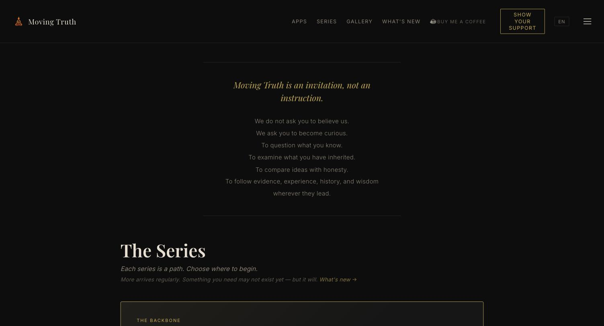
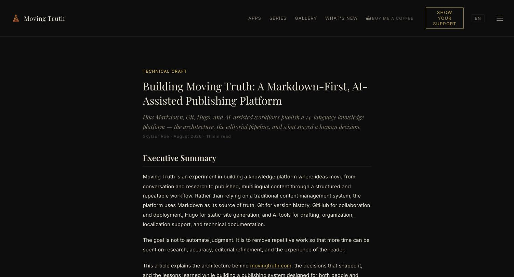
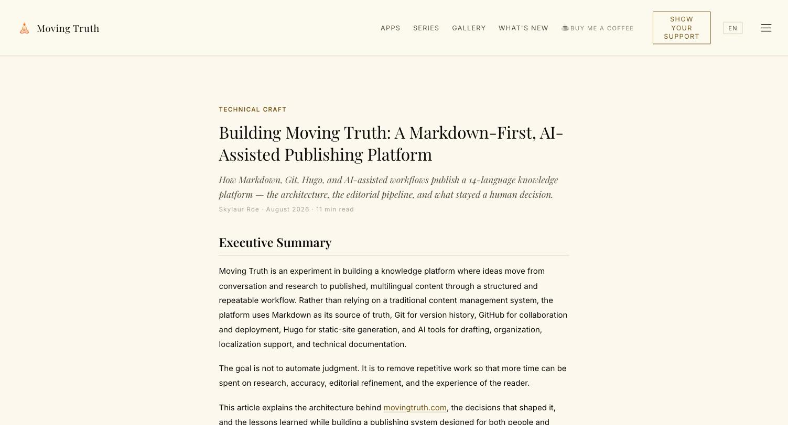

<p align="center">
  
</p>

<h1 align="center">Moving Truth</h1>
<p align="center"><em>Questions we were never encouraged to ask.</em></p>

<p align="center">
  <a href="https://movingtruth.com"><strong>movingtruth.com</strong></a>
  &nbsp;·&nbsp;
  <a href="https://movingtruth.com/craft/"><strong>How this site is built →</strong></a>
</p>

<p align="center">
  <a href="https://github.com/MovingTruth/MovingTruthLanding/actions/workflows/deploy.yml"></a>
  
  
  
  
  <a href="LICENSE"></a>
</p>

<p align="center">
  <strong>22</strong> pieces published across four series &nbsp;·&nbsp;
  <strong>14</strong> languages shipped &nbsp;·&nbsp;
  <strong>760+</strong> tracked Markdown files &nbsp;·&nbsp;
  <strong>0</strong> external CMS
</p>

<br>

<p align="center">
  
  
  
</p>
<p align="center">
  
</p>
<p align="center"><sub>Every page ships in a dark and a light theme, reader-selected and remembered.</sub></p>

---

## What this is

Moving Truth is a knowledge-publishing platform: a Hugo static site, a custom theme,
and an editorial pipeline that turns research and conversation into published,
14-language content with no traditional CMS in the loop. This repository is the
platform's entire public surface — content, theme, build, and deployment.

It's also a working example of AI-assisted engineering with a real division of
labor: models draft, restructure, and translate; a human decides what's true,
what's worth publishing, and what ships. That boundary — and where it actually
sits, file by file — is the subject of the technical writeup published on the
site itself:

> **[Building Moving Truth: A Markdown-First, AI-Assisted Publishing Platform](https://movingtruth.com/craft/)**
> Architecture, the editorial pipeline, the multilingual system, what's automated
> and what deliberately isn't, and the lessons that came out of running it.

Every technical change to this repository — not just the pieces — is logged in
[`CHANGELOG.md`](CHANGELOG.md): dated, file-level, with the reason it happened.

## Architecture

```text
Ideas & Research → Markdown → AI-Assisted Review + Human Review
        → Git → GitHub → GitHub Actions (hugo --minify) → GitHub Pages
        → movingtruth.com → Localized site builds (14 languages)
```

| Layer | Tool | Job |
|---|---|---|
| Source of truth | **Markdown + front matter** | Portable, human-readable, diffable content |
| Version history | **Git** | Every change traceable, nothing silently lost |
| Collaboration & CI | **GitHub + GitHub Actions** | Build triggers, review, deployment |
| Site generation | **Hugo** (custom `temple` theme) | Static build, multilingual routing |
| Hosting | **GitHub Pages** + Cloudflare DNS | No server to patch or scale |
| Editorial assistance | **Claude + ChatGPT** | Drafting, structure, translation QA, review — never final authority |

The full writeup covers *why* each of these choices was made and where the
boundary between AI assistance and human judgment actually sits:
**[read it →](https://movingtruth.com/craft/)**

## Repository layout

```text
MovingTruth/
├── content/             # Canonical + localized Markdown (14 languages)
│   ├── moving-truth/    # Main series
│   ├── what-if/         # Companion series
│   ├── blessings/       # Blessings series
│   └── craft.md         # This project's own technical writeup
├── i18n/                # Localized interface strings, one YAML per language
├── themes/temple/
│   ├── layouts/         # Hugo templates (one file, one job)
│   └── assets/
│       ├── css/         # temple.css — single stylesheet, CSS-variable design system
│       └── js/          # One module per responsibility, documented in CLAUDE.md
├── static/               # Images and files served from site root
├── .github/workflows/    # deploy.yml — build + GitHub Pages deploy on push to main
├── hugo.toml             # Site + language configuration
├── CHANGELOG.md          # Every technical change, dated, with file + reason
├── LICENSE               # MIT for code; content is separately rights-reserved
└── CLAUDE.md             # The engineering rulebook this repo is held to
```

## Multilingual by design

English is the canonical source; every piece, page, and interface string ships in:

`en` `es` `fr` `pt` `de` `ja` `ru` `zh` `ar` `ko` `th` `it` `nl` `hi`

Arabic renders right-to-left. Localization is treated as an architecture concern —
routing, templates, directionality, and workflow — not a translation pass bolted on
at the end. Details in the [Multilingual Publishing](https://movingtruth.com/craft/#multilingual-publishing)
section of the writeup.

## Local development

```bash
hugo server --baseURL http://localhost:1313/
```

The `--baseURL` flag is required locally — without it, fingerprinted CSS/JS resolve
to the production URL and styles break.

## Deployment

Every push to `main` triggers `.github/workflows/deploy.yml`: a pinned Hugo version
builds a minified site, uploads it as a Pages artifact, and GitHub Pages serves it
at movingtruth.com (DNS via Cloudflare, HTTPS via GitHub's managed certificate).
There's no server to maintain and no deploy step a human has to remember to run.

## Rights

Code, templates, and build configuration in this repository are [MIT-licensed](LICENSE).
Written content in `content/` (the Moving Truth and What If series, and related
pieces) is excluded — © Skylaur Roe, all rights reserved.

---

<p align="center"><sub>Built and written under the name <strong>Skylaur Roe</strong>.</sub></p>
